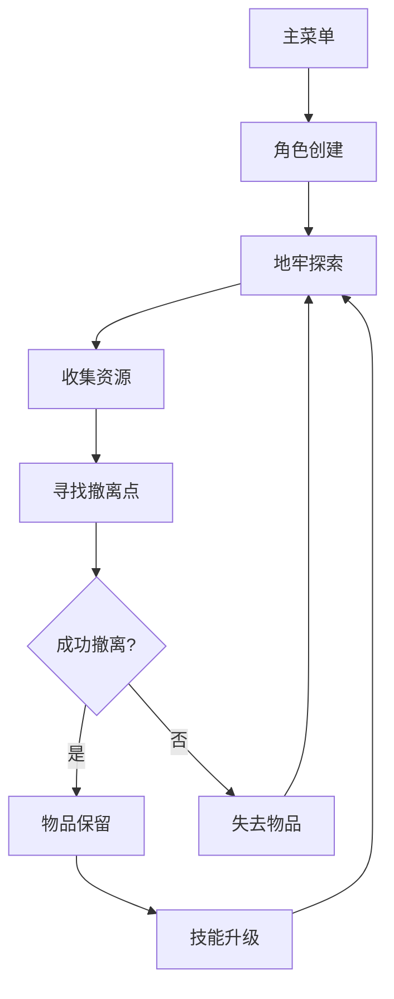

## 1. Product Overview
2.5D地牢类游戏，融合未来机甲题材与撤离机制，提供紧张刺激的探索与生存体验。
- 玩家将扮演机甲战士，在危险的地牢中探索、收集资源并安全撤离。
- 目标用户为喜欢战术策略和生存类游戏的玩家，市场价值在于独特的撤离机制和技能系统。

## 2. Core Features

### 2.1 User Roles
| Role | Registration Method | Core Permissions |
|------|---------------------|------------------|
| Player | Local account creation | Create character, explore dungeons, collect items, level up skills |

### 2.2 Feature Module
1. **Main Menu**: character creation, game settings, multiplayer setup
2. **Dungeon Exploration**: map navigation, combat, item collection
3. **Character Management**: skill tree, inventory, equipment
4. **撤离机制**: extraction points, time limit, risk-reward decisions

### 2.3 Page Details
| Page Name | Module Name | Feature description |
|-----------|-------------|---------------------|
| Main Menu | Character Creation | Create and customize机甲战士，选择初始技能和装备 |
| Main Menu | Multiplayer Setup | 局域网连接设置，创建/加入游戏房间 |
| Dungeon Exploration | Map Navigation | 2.5D视角地牢探索，障碍物交互，敌人遭遇 |
| Dungeon Exploration | Combat System | 实时战斗，技能释放，掩体利用 |
| Dungeon Exploration | Item Collection | 资源收集，装备拾取，物品管理 |
| Dungeon Exploration | Extraction System | 寻找撤离点，在时间限制内到达，抵御敌人进攻 |
| Character Management | Skill Tree | 三角洲干员风格技能加点，分支升级路径 |
| Character Management | Inventory | 物品保留系统，装备栏管理，资源存储 |

## 3. Core Process
玩家创建角色后，进入地牢探索，收集资源和装备，在时间耗尽前找到撤离点并成功撤离。撤离后保留收集的物品和获得的经验，用于技能升级和装备强化。

## 4. User Interface Design
### 4.1 Design Style
- 主色调：深蓝色(#1a1a2e)和荧光蓝(#00d4ff)，辅以暗灰色(#2a2a3e)作为背景
- 按钮风格：3D金属质感，带有科技感的发光边缘
- 字体：未来主义无衬线字体，如Orbitron
- 布局风格：卡片式布局，带有全息投影效果
- 图标风格：霓虹风格，带有科技感的线条和几何形状

### 4.2 Page Design Overview
| Page Name | Module Name | UI Elements |
|-----------|-------------|-------------|
| Main Menu | Character Creation | 机甲定制界面，3D预览，技能选择树，装备预览 |
| Dungeon Exploration | Map Navigation | 2.5D等距视角，动态光照，粒子效果，环境互动元素 |
| Dungeon Exploration | Combat System | 实时战斗界面，技能快捷键，伤害数值，生命值/能量条 |
| Dungeon Exploration | Extraction System | 撤离点标记，倒计时计时器，敌人波次指示器 |
| Character Management | Skill Tree | 分支技能树，升级动画，技能效果预览 |
| Character Management | Inventory | 网格背包系统，物品分类，装备栏，资源统计 |

### 4.3 Responsiveness
- 桌面优先设计，支持键盘鼠标操作
- 适配不同屏幕分辨率，优化1920x1080及以上分辨率
- 支持控制器操作，提供键位映射选项

### 4.4 3D Scene Guidance
- 环境：未来机甲风格地牢，金属结构，霓虹灯光，科技感十足
- 光照：动态光源，闪烁的荧光灯，武器和技能的发光效果
- 相机：固定等距视角，可轻微旋转和缩放
- 交互：物体碰撞，掩体系统，环境破坏效果
- 后处理：轻微的扫描线效果，增强科技感