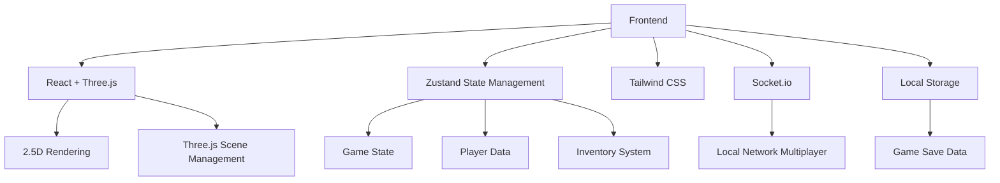
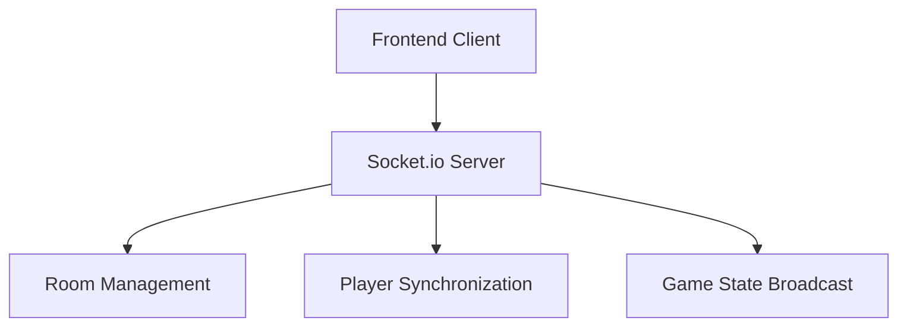
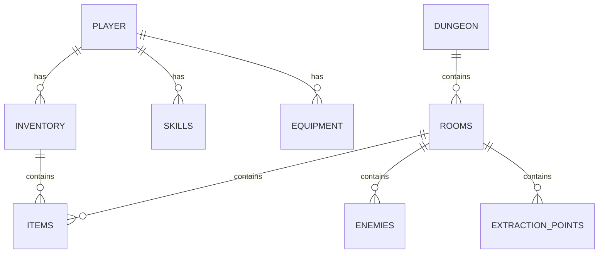

## 1. Architecture Design


## 2. Technology Description
- Frontend: React@18 + TypeScript + Vite + Tailwind CSS
- 3D Rendering: Three.js + @react-three/fiber + @react-three/drei
- State Management: Zustand
- Multiplayer: Socket.io (局域网连接)
- Storage: LocalStorage (本地存储游戏数据)
- Physics: Matter.js (碰撞检测和物理模拟)
- Animation: Framer Motion (UI动画)

## 3. Route Definitions
| Route | Purpose |
|-------|---------|
| / | Main Menu |
| /character-creation | Character Creation |
| /multiplayer | Multiplayer Setup |
| /dungeon | Dungeon Exploration |
| /character | Character Management |

## 4. API Definitions
### Local Storage API
- `saveGame(data)`: 保存游戏数据到本地存储
- `loadGame()`: 从本地存储加载游戏数据
- `saveCharacter(character)`: 保存角色数据
- `loadCharacter()`: 加载角色数据

### Socket.io Events
- `joinRoom(roomId)`: 加入游戏房间
- `leaveRoom()`: 离开游戏房间
- `playerMove(position)`: 玩家移动同步
- `playerAttack(attackData)`: 玩家攻击同步
- `playerCollect(item)`: 物品收集同步
- `playerExtract()`: 撤离状态同步

## 5. Server Architecture Diagram


## 6. Data Model
### 6.1 Data Model Definition


### 6.2 Data Definition Language
#### Player Data
```typescript
interface Player {
  id: string;
  name: string;
  level: number;
  experience: number;
  health: number;
  energy: number;
  skills: Skill[];
  equipment: Equipment[];
  inventory: Inventory;
}

interface Skill {
  id: string;
  name: string;
  level: number;
  description: string;
  effects: SkillEffect[];
}

interface Equipment {
  id: string;
  name: string;
  type: EquipmentType;
  stats: EquipmentStats;
  rarity: Rarity;
}

interface Inventory {
  items: Item[];
  capacity: number;
}

interface Item {
  id: string;
  name: string;
  type: ItemType;
  value: number;
  effects: ItemEffect[];
  quantity: number;
}
```

#### Dungeon Data
```typescript
interface Dungeon {
  id: string;
  name: string;
  difficulty: number;
  rooms: Room[];
  timeLimit: number;
}

interface Room {
  id: string;
  position: Vector3;
  enemies: Enemy[];
  items: Item[];
  extractionPoint: ExtractionPoint | null;
}

interface Enemy {
  id: string;
  name: string;
  health: number;
  damage: number;
  type: EnemyType;
  position: Vector3;
}

interface ExtractionPoint {
  id: string;
  position: Vector3;
  activationTime: number;
  isActive: boolean;
}
```

#### Game State
```typescript
interface GameState {
  currentDungeon: Dungeon | null;
  players: Player[];
  isExtractionActive: boolean;
  timeRemaining: number;
  gameStatus: GameStatus;
}
```